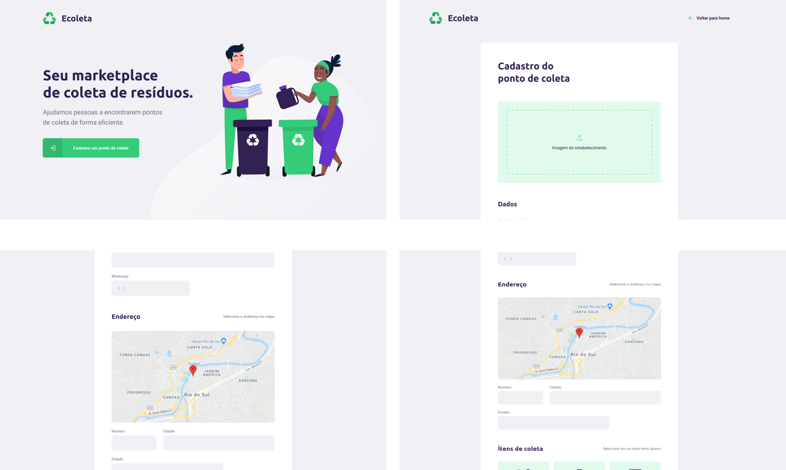

<h1 align="center">
    
</h1>

<h4 align="center"> 
	🚧 NextLevelWeek 1.0 🚀 em construção... 🚧
</h4>

<p align="center">
  

  


  
</p>


## 💻 Sobre o projeto

♻️ Ecoleta - é uma forma de conectar empresas e entidades de coleta de resíduos orgânicos e inorgânicos as pessoas que precisam descartar seus resíduos de maneira ecológica.

As empresas ou entidades poderão se cadastrar na plataforma web enviando:
- uma imagem do ponto de coleta
- nome da entidade, email e whatsapp
- e o endereço para que ele possa aparecer no mapa
- além de selecionar um ou mais ítens de coleta: 
  - lâmpadas
  - pilhas e baterias
  - papéis e papelão
  - resíduos eletrônicos
  - resíduos orgânicos
  - óleo de cozinha

Os usuários terão acesso ao aplicativo móvel, onde poderão:
- navegar pelo mapa para ver as instituições cadastradas
- entrar em contato com a entidade através do E-mail ou do WhatsApp

Projeto desenvolvido durante a **NLW - Next Level Week** oferecida pela [Rocketseat](rs).
O NLW é uma experiência online com muito conteúdo prático, desafios e hacks onde o conteúdo fica disponível durante uma semana.


## 🎨 Layout


### Mobile

<p align="center">
  

  
</p>

### Web

<p align="center" style="display: flex; align-items: flex-start; justify-content: center;">
  

  
</p>

## 🛠 Tecnologias

As seguintes ferramentas foram usadas na construção do projeto:

- [Node.js](https://nodejs.org/en/)
- [React](https://reactjs.org)
- [React Native](https://facebook.github.io/react-native/)
- [Expo](https://expo.io/)
- [TypeScript](https://www.typescriptlang.org/)


## 🚀 Como executar o projeto

Podemos considerar este projeto como sendo divido em três partes:
1. Back End (pasta server) 
2. Front End (pasta web)
3. Mobile (pasta mobile)

💡Tanto o Front End quanto o Mobile precisam que o Back End esteja sendo executado para funcionar.

### 🎲 Back End 

```bash
# Clone este repositório
$ git clone https://github.com/maycon8609/Ecoleta

# Acesse a pasta do projeto no terminal/cmd
$ cd Ecoleta

# Vá para a pasta server
$ cd server

# Instale as dependências
$ yarn install

# Execute a aplicação em modo de desenvolvimento
$ yarn dev

# O servidor inciará na porta:3333 - acesse http://localhost:3333 
```

### 🧭 Front End

```bash
# Clone este repositório
$ git clone https://github.com/maycon8609/Ecoleta

# Acesse a pasta do projeto no seu terminal/cmd
$ cd Ecoleta

# Vá para a pasta da aplicação Front End
$ cd web

# Instale as dependências
$ yarn install

# Execute a aplicação em modo de desenvolvimento
$ yarn start

# A aplicação será aberta na porta:3000 - acesse http://localhost:3000
```

## 📝 Licença

Este projeto esta sobe a licença MIT.

❤️ maycon silva 👋🏽